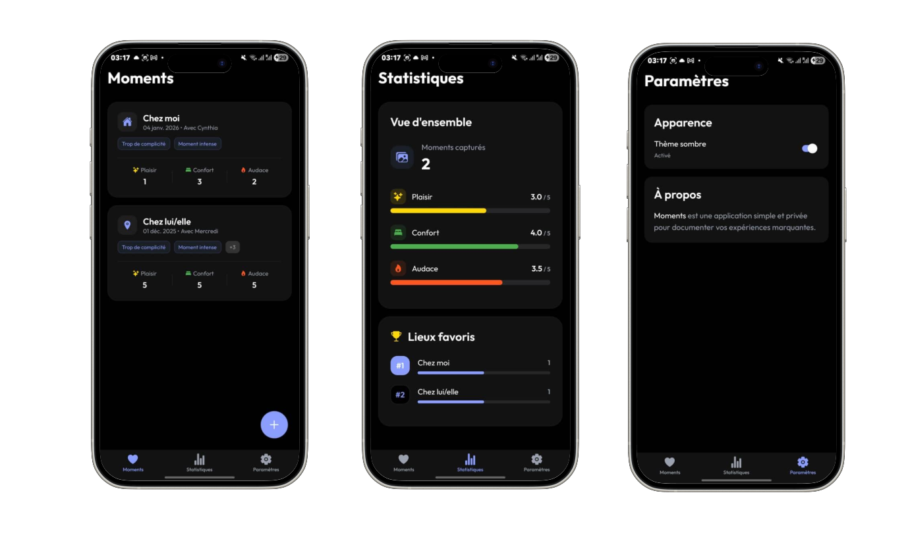

# 💑 Moments - Journal de Couple

Une application React Native **premium**, confidentielle et **hors-ligne** conçue pour les couples. Notez, évaluez et chérissez vos moments partagés. Développée avec **Expo** et **TypeScript**.

## 📸 Aperçu

<p align="center">
  
</p>

## ✨ Fonctionnalités

*   **📝 Capturer l'Instant** : Enregistrez vos moments intimes ou spéciaux avec date, lieu et compagnon/compagne.
*   **⭐ Évaluation Détaillée** : Évaluez vos expériences sur trois critères : **Plaisir**, **Confort** et **Audace** via un système d'étoiles intuitif.
*   **🏷️ Tags Top & Flop** : Ajoutez des tags pour vous souvenir de ce qui a fonctionné au top ou moins bien (flops).
*   **📊 Tableau de Bord Statistiques** : Visualisez l'évolution de votre relation avec des moyennes, le total des moments et vos lieux favoris (trophées).
*   **🎨 Design Premium** : Une interface moderne et esthétique utilisant la police **Outfit**, un mode sombre "Vrai Noir" (OLED) et des touches de glassmorphism.
*   **🔒 Privé & Hors-ligne** : Toutes les données sont stockées de manière sécurisée sur votre appareil via **SQLite**. Aucun compte ni connexion internet requis.
*   **🌙 Mode Sombre** : Un thème sombre profond, parfait pour une utilisation nocturne confortable.

## 🛠 Stack Technique

*   **Framework** : [React Native](https://reactnative.dev/) avec [Expo SDK](https://expo.dev/) (~54)
*   **Langage** : [TypeScript](https://www.typescriptlang.org/)
*   **Navigation** : [Expo Router](https://docs.expo.dev/router/introduction/) (Routage basé sur les fichiers)
*   **Base de données** : [Expo SQLite](https://docs.expo.dev/versions/latest/sdk/sqlite/) (Persistance locale)
*   **Gestion d'état** : [Zustand](https://github.com/pmndrs/zustand)
*   **Polices** : [Outfit](https://fonts.google.com/specimen/Outfit) via `@expo-google-fonts`
*   **Icônes** : [Ionicons](https://ionic.io/ionicons) via `@expo/vector-icons`

## 🚀 Pour Commencer

### Prérequis

*   **Node.js** (Version LTS recommandée)
*   **npm** ou **yarn**
*   **Expo Go** installé sur votre téléphone (iOS/Android) OU Android Studio/Xcode pour les émulateurs.

### Installation

1.  **Cloner le dépôt**
    ```bash
    git clone https://github.com/votre-username/moments-app.git
    cd moments-app
    ```

2.  **Installer les dépendances**
    ```bash
    npm install
    ```

3.  **Lancer l'application**
    ```bash
    npm start
    ```

4.  **Lancer sur Appareil/Émulateur**
    *   Appuyez sur `a` pour l'émulateur Android.
    *   Appuyez sur `i` pour le simulateur iOS (macOS seulement).
    *   Scannez le QR code avec votre téléphone (Appareil photo sur iOS, appli Expo Go sur Android).

## 📂 Structure du Projet

```
moments-app/
├── app/                  # Écrans et Navigation (Expo Router)
│   ├── (tabs)/           # Navigation par onglets (Accueil, Stats, Paramètres)
│   ├── moment/           # Écrans de détails
│   └── _layout.tsx       # Layout racine, ThemeProvider, Chargement des polices
├── components/           # Composants UI réutilisables
│   ├── common/           # Boutons génériques, inputs, FAB
│   └── moments/          # Cartes de moments, étoiles de notation
├── constants/            # Fichiers de configuration
│   ├── theme.ts          # Thème centralisé (Couleurs, Typographie, Espacement)
│   └── suggestions.ts    # Tags prédéfinis pour les chips
├── services/             # Logique Backend
│   └── database.ts       # Initialisation SQLite et requêtes
├── store/                # Gestion d'état
│   ├── momentsStore.ts   # Opérations CRUD pour les moments
│   └── settingsStore.ts  # Préférences de thème
└── assets/               # Polices et images
```

## 🎨 Personnalisation

L'application utilise un système de thème centralisé dans `constants/theme.ts`. Vous pouvez facilement modifier l'apparence :

*   **Couleurs** : Ajustez `lightColors` et `darkColors` pour changer la palette.
*   **Typographie** : L'application utilise la famille de police **Outfit** par défaut.
*   **Formes** : Ajustez `borderRadius` dans `constants/theme.ts` pour changer l'arrondi global des boutons et cartes.

## 🤝 Contribuer

Les contributions sont les bienvenues ! Ce projet est open-source.
Veuillez consulter le fichier `CONTRIBUTING.md` pour savoir comment proposer des changements, signaler des bugs ou suggérer des fonctionnalités.

## 📝 Licence

Ce projet est disponible pour un usage personnel et la communauté open source.

---
*Créé avec ❤️ pour des relations épanouies.*
